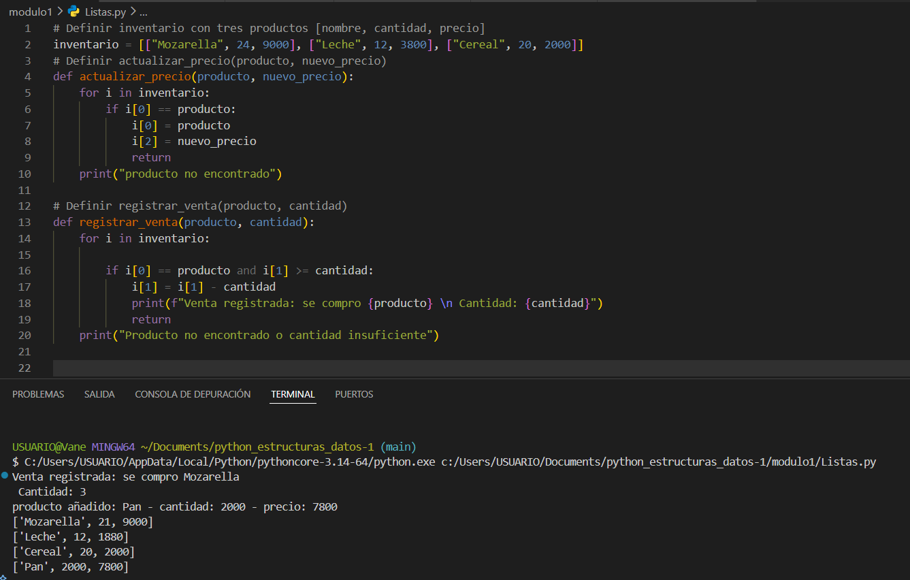
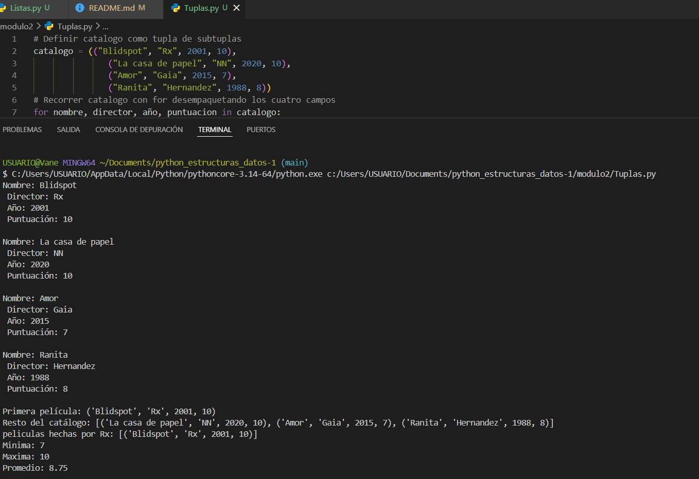
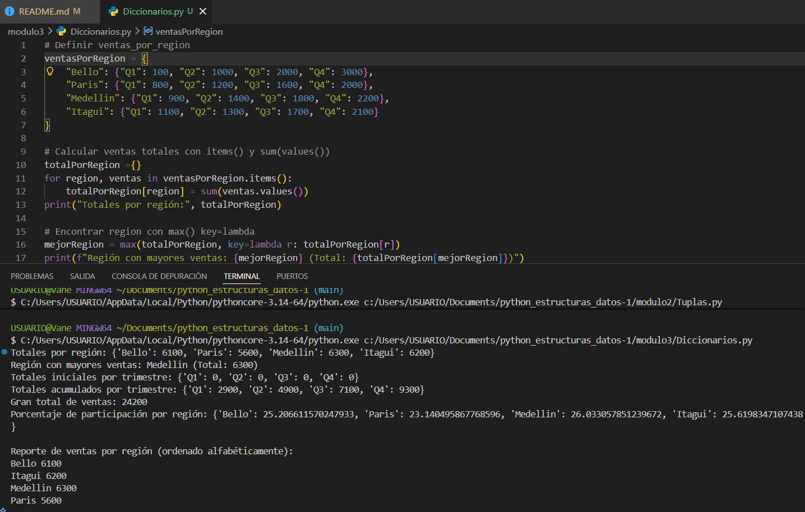
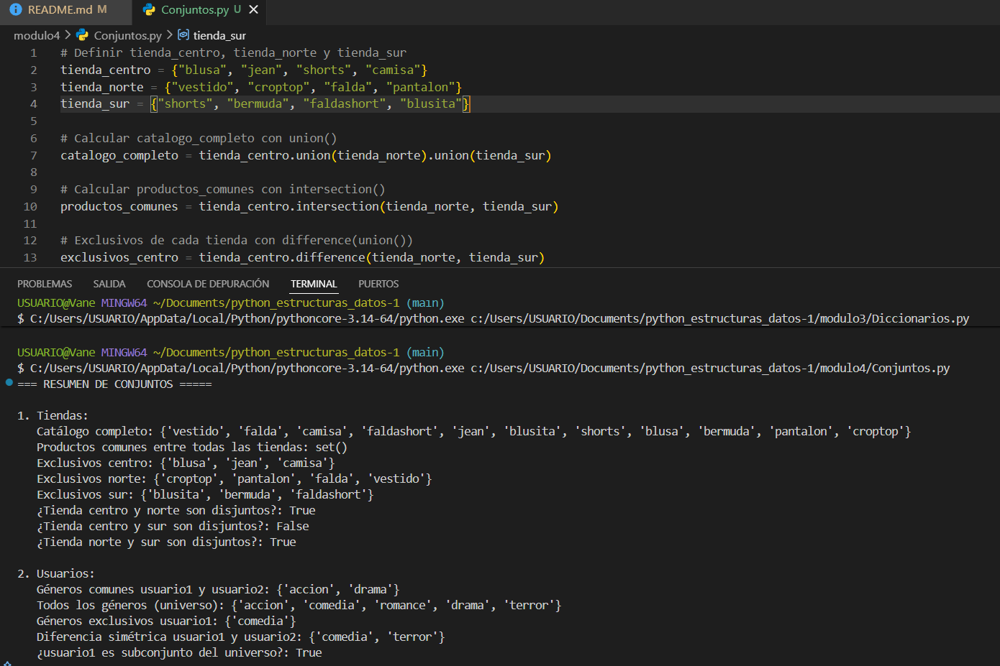
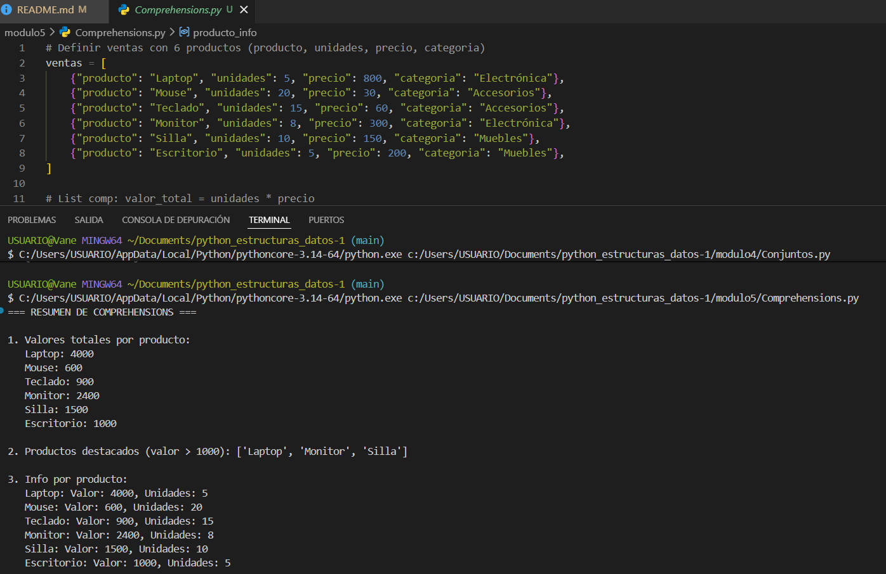
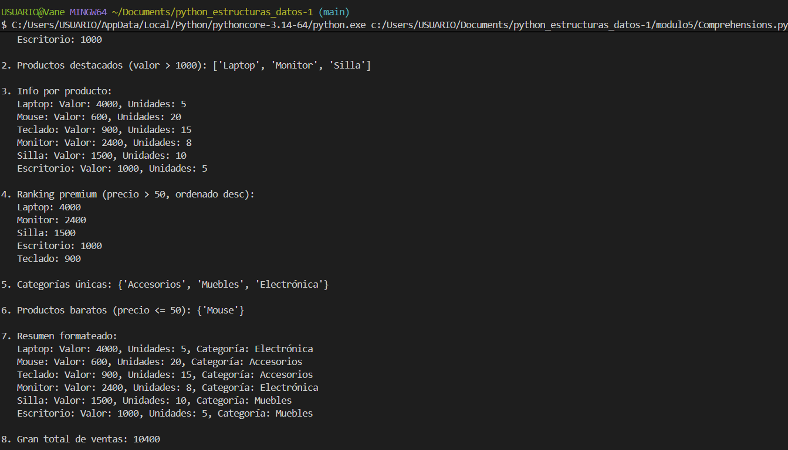

# python_estructuras_datos
**Autor:** Vanessa Ocampo Zapata
**Fecha:** 05 de Mayo 2026

## 1. Descripción del Proyecto
Este repositorio contiene una serie de retos prácticos diseñados para afianzar el conocimiento de las estructuras de datos nativas de Python. Se divide en 5 módulos independientes, cada uno enfocado en una estructura diferente:

- Módulo 1: Listas
- Módulo 2: Tuplas
- Módulo 3: Diccionarios
- Módulo 4: Conjuntos
- Módulo 5: Comprehensions

Cada módulo incluye un script '.py' con la solución del reto planteado y evidencia visual de su ejecución.

#  Modulo 1: Listas 

**Conceptos clave:** Mutabilidad de listas, indexación por posición (i[0], i[1], i[2]), función return para salida anticipada, f-strings para mensajes formateados. 
**Reto:** Implementar un sistema de inventario que permita actualizar precios, registrar ventas y añadir nuevos productos usando listas anidadas. 
**Evidencia:**  
Captura que muestra en la parte superior el código del reto en VS Code, con la definición del inventario inicial como lista de listas con tres productos (Mozarella, Leche, Cereal), y dos funciones para gestionar el inventario: actualizar_precio, que recorre el inventario con un for y reemplaza el precio cuando encuentra el producto por nombre, y registrar_venta, que verifica que el producto exista y que haya stock suficiente antes de descontar la cantidad vendida. En la parte inferior, la ejecución en la terminal muestra: 1) Mensaje de venta registrada de 3 unidades de Mozarella, 2) Confirmación de adición del producto Pan (cantidad 2000, precio 7800), 3) Listado final del inventario con 4 productos, donde se refleja el precio actualizado de Leche a 1880 y las 21 unidades restantes de Mozarella tras la venta.

#  Modulo 2: Tuplas 

**Conceptos clave:** Inmutabilidad de tuplas, desempaquetado de tuplas en el for (nombre, director, año, puntuacion), indexación, slicing (catalogo[0], catalogo[1:]), funciones min(), max() y cálculo de promedio sobre valores extraídos de tuplas.
**Reto:** Implementar un catálogo de películas usando tuplas anidadas que permita recorrer y mostrar la información, filtrar por director, acceder a la primera película y al resto del catálogo, y calcular estadísticas de puntuación.
**Evidencia:**  
Captura que muestra en la parte superior el código en VS Code, con la definición del catálogo como tupla de subtuplas de cuatro campos cada una (nombre, director, año, puntuación) con cuatro películas: Blidspot, La casa de papel, Amor y Ranita, y el inicio del recorrido con for desempaquetando los cuatro campos directamente. En la parte inferior, la ejecución en la terminal muestra: 1) Los cuatro registros impresos uno a uno con sus campos etiquetados (Nombre, Director, Año, Puntuación), 2) La primera película accedida por índice (catalogo[0]), 3) El resto del catálogo como lista mediante slicing, 4) El filtro de películas dirigidas por Rx, 5) Las estadísticas de puntuación con mínima 7, máxima 10 y promedio 8.75.

#  Modulo 3: Diccionarios 

**Conceptos clave:** Diccionarios anidados, recorrido con .items(), suma de valores con sum(values()), uso de max() con key=lambda, acumulación de totales por clave, cálculo de porcentajes y ordenamiento alfabético con sorted().
**Reto:** Implementar un sistema de análisis de ventas por región usando diccionarios anidados que permita calcular totales por región y por trimestre, identificar la región con mayores ventas, obtener porcentajes de participación y generar un reporte ordenado alfabéticamente.
**Evidencia:**  
Captura que muestra en la parte superior el código en VS Code, con la definición del diccionario ventasPorRegion que contiene cuatro regiones (Bello, Paris, Medellin, Itagui) cada una con sus ventas de los cuatro trimestres (Q1 a Q4), y las operaciones de análisis usando .items() para recorrer el diccionario y sum(ventas.values()) para totalizar cada región, seguido de max() con key=lambda para encontrar la región líder. En la parte inferior, la ejecución en la terminal muestra: 1) Totales por región (Bello: 6100, Paris: 5600, Medellin: 6300, Itagui: 6200), 2) Región con mayores ventas: Medellin con 6300, 3) Totales iniciales por trimestre en cero y luego los acumulados (Q1: 2900, Q2: 4900, Q3: 7100, Q4: 9300), 4) Gran total de ventas: 24200, 5) Porcentaje de participación por región, 6) Reporte final ordenado alfabéticamente de Bello a Paris.

#  Modulo 4: Conjuntos 

**Conceptos clave:** Definición de conjuntos con {}, operaciones de unión con .union(), intersección con .intersection(), diferencia con .difference(), verificación de conjuntos disjuntos con .isdisjoint() y comprobación de subconjuntos con .issubset().
**Reto:** Implementar un sistema de análisis de catálogos usando conjuntos que permita combinar productos de múltiples tiendas, encontrar productos comunes, identificar exclusivos de cada tienda, verificar si las tiendas comparten productos y aplicar las mismas operaciones a preferencias de géneros de usuarios.
**Evidencia:**  
Captura que muestra en la parte superior el código en VS Code, con la definición de tres conjuntos de tiendas (tienda_centro, tienda_norte, tienda_sur) cada una con sus productos de ropa, y las operaciones: .union() encadenado para obtener el catálogo completo, .intersection() con múltiples conjuntos para productos comunes y .difference() para los exclusivos de cada tienda. En la parte inferior, la ejecución en la terminal muestra dos secciones: 1) Tiendas: catálogo completo con los 11 productos unidos, productos comunes entre las tres tiendas vacío (set()), exclusivos de cada tienda (blusa/jean/camisa para centro, croptop/pantalon/falda/vestido para norte, blusita/bermuda/faldashort para sur), y verificación de conjuntos disjuntos donde centro y sur resultan False por compartir "shorts"; 2) Usuarios: géneros comunes entre usuario1 y usuario2 (accion, drama), universo completo de géneros, exclusivos de usuario1 (comedia), diferencia simétrica (comedia, terror) y confirmación de que usuario1 es subconjunto del universo.

#  Modulo 5: Comprehensions 

**Conceptos clave:** List comprehensions para calcular valores y filtrar con condiciones, dict comprehensions para construir resúmenes por producto, set comprehensions para extraer valores únicos, uso de sorted() con key y reverse=True para ordenamiento descendente, y sum() sobre una list comprehension para totales.
**Reto:** Implementar un sistema de análisis de ventas usando comprehensions que permita calcular el valor total por producto, filtrar destacados y premium, construir resúmenes formateados, identificar categorías únicas, detectar productos baratos y obtener el gran total de ventas.
**Evidencia:**   y 
Captura que muestra en la parte superior el código en VS Code, con la definición de la lista ventas compuesta por 6 diccionarios, cada uno con los campos producto, unidades, precio y categoría (Laptop, Mouse, Teclado, Monitor, Silla y Escritorio en categorías Electrónica, Accesorios y Muebles), y el inicio de las comprehensions calculando valor_total = unidades * precio. En la terminal se muestran 8 resultados: 1) Valores totales por producto calculados con list comprehension (Laptop: 4000, Monitor: 2400, Silla: 1500, entre otros), 2) Productos destacados con valor mayor a 1000: Laptop, Monitor y Silla, 3) Info por producto con valor y unidades mediante dict comprehension, 4) Ranking premium con precio mayor a 50 ordenado descendente (Laptop, Monitor, Silla, Escritorio, Teclado), 5) Categorías únicas obtenidas con set comprehension: Accesorios, Muebles, Electrónica, 6) Productos baratos con precio menor o igual a 50: Mouse, 7) Resumen formateado completo con valor, unidades y categoría por producto, 8) Gran total de ventas: 10400.